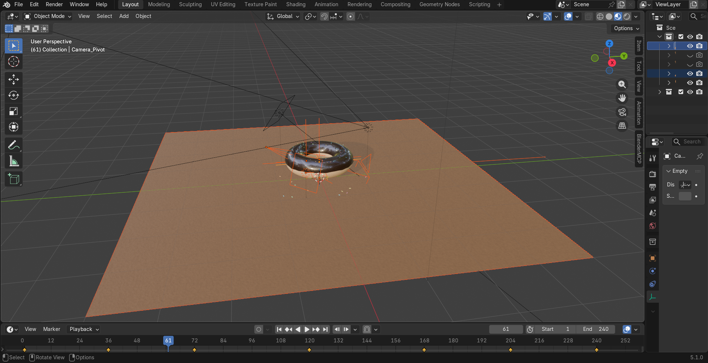
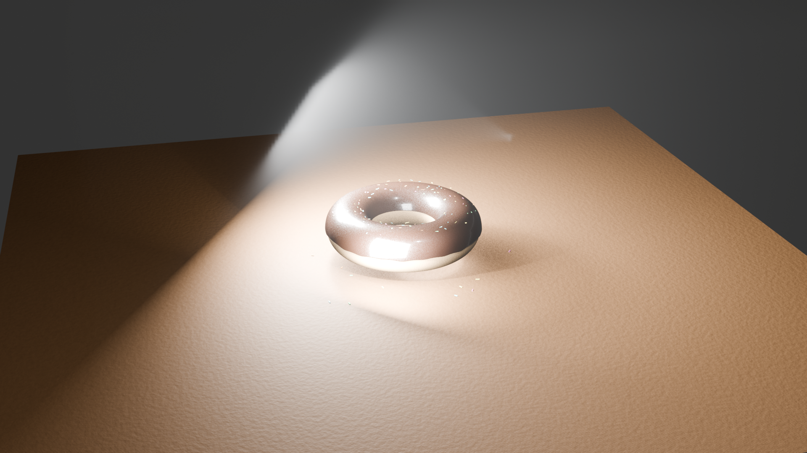
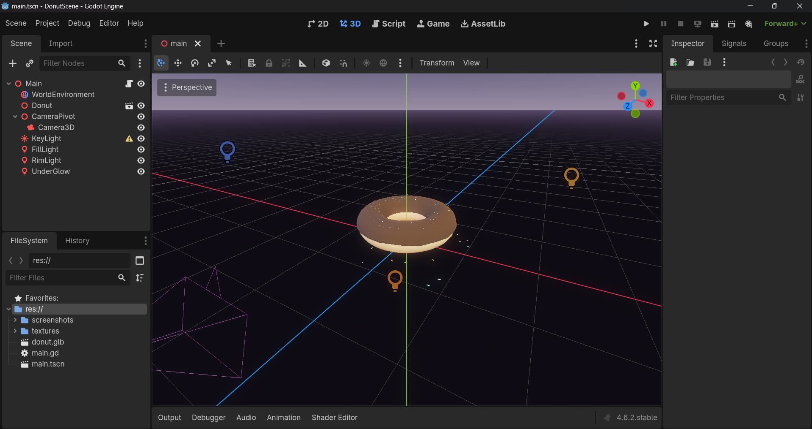

# DonutScene

A 3D donut modeled in Blender and brought to life with real-time animations in the Godot Engine.

## The Modeling Process (Blender)

The donut model was fully created from scratch in Blender 5.1. It features detailed procedural geometry for the bread base and the icing, topped off with organically placed candy sprinkles. We utilized advanced node setups to generate hyper-realistic texturing before baking the materials down seamlessly into color, roughness, and normal maps.

*A look inside the Blender viewport showing the modeling and node structure.*

*The final beauty render produced natively in Blender's rendering engine.*

## The Real-Time Scene (Godot)

After exporting the donut asset as a `.glb` file, we imported it into Godot 4.6 to create a fully dynamic, real-time 3D scene. The PBR materials were accurately reassembled via GDScript—incorporating subsurface scattering for the bread and clearcoat gloss for the icing. We finalized the environment with cinematic 4-point lighting and a procedural sky.

  
*The final assembled scene running real-time inside the Godot Engine.*

## Animation Preview

Click the video link below to see the final orbiting animation running live in Godot:
[🎥 Watch the Final Animation (Godot)](screenshots/final_animation_godot.mp4)

## MCP Servers Used

This project was built aggressively using the Model Context Protocol (MCP) to allow AI coding assistants to directly interface with the modeling tools and game engine. 

- **Blender MCP Server**: [https://github.com/ahujasid/blender-mcp](https://github.com/ahujasid/blender-mcp) used for manipulating 3D assets and baking PBR textures.
- **Godot MCP Server**: [https://github.com/tugcantopaloglu/godot-mcp](https://github.com/tugcantopaloglu/godot-mcp) used for dynamically creating scenes, adding lighting, setting up the camera rig, and creating animations via GDScript.

## Guide: How to Run This Project

1. Clone or download this repository to your local machine.
2. Ensure you have [Godot Engine 4.6+](https://godotengine.org/download/) installed (Standard edition is fine).
3. Open Godot and click **Import**.
4. Navigate into the downloaded folder and select the `project.godot` file.
5. Once the project opens in Godot, press **F5** (or click the 'Play' button mapped to the main scene) to run the animation.
